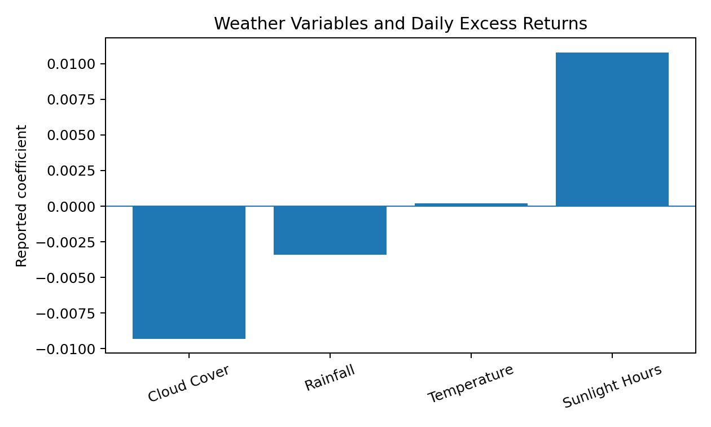
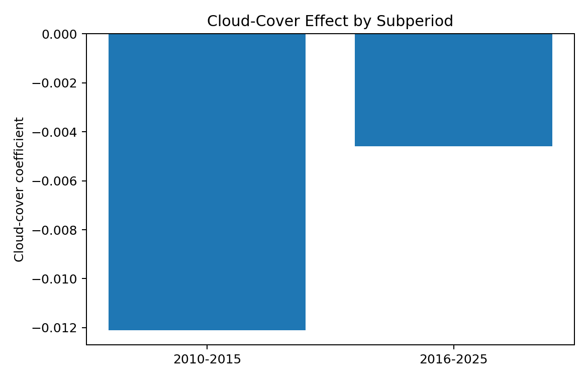

# Weather-Induced Sentiment and Market Reactions (2010–2025)

This repository accompanies my research paper **“Weather-Induced Sentiment and Market Reactions (2010–2025).”** The study asks whether local weather conditions are associated with short-run market returns and trading activity through investor mood and attention.

> **Research status:** SSRN (2025)

[Read the full paper](paper/Weather_Market_Sentiment_Paper.pdf)

## Research question

Do cloud cover, rainfall, temperature, and sunlight help explain daily excess returns and trading volume after controlling for systematic risk and calendar/location effects?

The paper matches **NOAA weather data** with **CRSP daily market data** and **Fama–French five-factor controls** over 2010–2025.

## Empirical framework

The research design follows this pipeline:

1. Match exchange-city weather observations to daily market observations.
2. Construct cloud cover, rainfall, temperature, and sunlight variables.
3. Estimate excess-return and trading-volume regressions with Fama–French controls.
4. Include city and month fixed effects and cluster standard errors by city and year.
5. Test interactions with VIX and Monday indicators and compare pre/post-2015 subperiods.
6. Run robustness checks excluding micro-caps and adding lagged weather and sentiment controls.

## Reported results

The paper reports that greater cloud cover and rainfall are associated with lower returns and trading activity, while more sunlight is associated with higher returns and volume.

| Variable | Return coefficient | t-statistic | Direction |
|---|---:|---:|---|
| Cloud Cover | -0.0093 | -2.71 | Negative |
| Rainfall | -0.0034 | -1.94 | Negative |
| Temperature | +0.0002 | 0.18 | Not significant |
| Sunlight Hours | +0.0108 | 2.46 | Positive |



The reported cloud-cover association is stronger in 2010–2015 and weaker in 2016–2025, consistent with the paper's hypothesis that automation may attenuate human mood channels.



## Repository contents

- `paper/` — full research paper.
- `src/weather_features.py` — weather-variable preparation helpers.
- `src/regressions.py` — return/volume regression templates with fixed effects.
- `src/make_figures.py` — recreates visual summaries from the paper's reported tables.
- `results/` — paper-reported return, volume, subperiod, and robustness results in CSV form.
- `figures/` — visual summaries of the reported findings.

## Reproducibility note

Licensed CRSP/WRDS data used in the research are **not redistributed in this repository**. NOAA weather data are public, but this repository does not claim to regenerate the full raw-data analysis from redistributed source data. The included CSV files and figures reproduce **reported summary results from the paper**, while the code provides a transparent implementation template for the empirical workflow.

## Research and implementation note

I developed the research question, empirical design, model-selection reasoning, interpretation, and manuscript. **AI-assisted programming tools were used to help translate the methodology into code and support implementation/debugging while I developed my programming proficiency.**

The repository is intended to make the quantitative reasoning and workflow behind the research easier to inspect and discuss.

## Run locally

```bash
pip install -r requirements.txt
python src/make_figures.py
```
